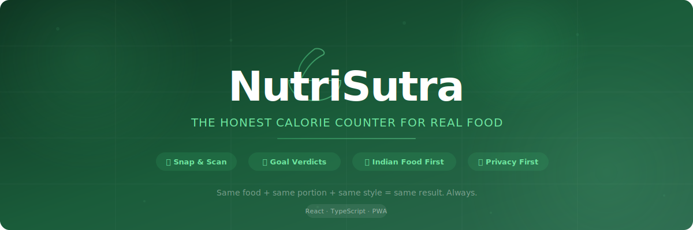
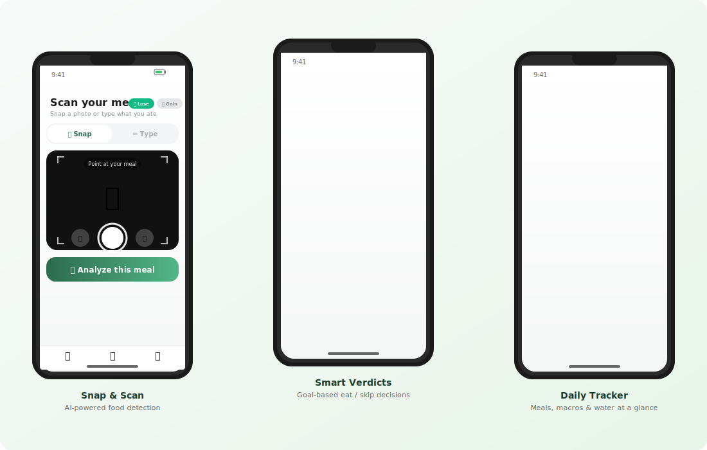
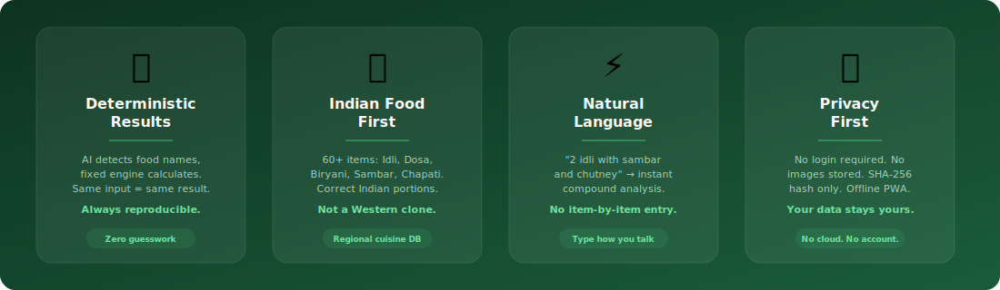

<div align="center">



<br/>
<br/>

**The honest calorie counter for real food.**<br/>
Same food + same portion + same style = same result. Always.

<br/>

[](https://react.dev)
[](https://typescriptlang.org)
[](https://vitejs.dev)
[](https://tailwindcss.com)
[](#)

<br/>

[Features](#-features) · [Screenshots](#-screenshots) · [Quick Start](#-quick-start) · [Architecture](#-architecture) · [How It Works](#-how-it-works) · [Comparison](#-nutrisutra-vs-competitors)

</div>

<br/>

## What is NutriSutra?

NutriSutra is a **mobile-first nutrition analysis PWA** built for Indian, Asian, and Western meals. Unlike Cal AI or MyFitnessPal, it uses AI **only for food detection** from images — all nutrition calculations run through a **deterministic, rule-based engine** with fixed multipliers. No black-box guesswork.

> **Type** `"2 idli with sambar and chutney"` → get instant calories, macros, and a goal-based verdict in under a second.

<br/>

## 📱 Screenshots

<div align="center">



<br/>
<br/>

<table>
<tr>
<td align="center"><strong>📸 Snap & Scan</strong><br/><sub>Live camera or gallery upload<br/>AI-powered food detection</sub></td>
<td align="center"><strong>🎯 Smart Verdicts</strong><br/><sub>Goal-based eat/skip decisions<br/>Per-component breakdown</sub></td>
<td align="center"><strong>📊 Daily Tracker</strong><br/><sub>Meals, macros & water<br/>No login required</sub></td>
</tr>
</table>

</div>

<br/>

## ✨ Features

<div align="center">



</div>

<br/>

### Core Capabilities

| Feature | Description |
|:--------|:------------|
| 🗣️ **Natural Language Input** | Type `"chicken biryani half plate"` or `"coffee with 8 soaked almonds"` — compound meals parsed in one go |
| 📸 **Snap & Scan** | Live camera capture + gallery upload → AI detects food → deterministic engine calculates |
| 🎯 **Goal-Based Verdicts** | Real-time 🟢 Good / 🟡 Moderate / 🔴 Avoid decisions based on Lose / Gain / Maintain goals |
| 🍛 **Indian Food First** | 60+ items: Idli, Dosa, Biryani, Sambar, Chapati, Dal, Filter Coffee, Pongal, and more |
| 🧮 **Cooking Style Modifiers** | `fried`, `steamed`, `ghee`, `oily`, `homemade`, `restaurant` — each adjusts calories & fat with fixed multipliers |
| 📊 **Daily Tracker** | Breakfast / Lunch / Dinner / Snacks slots with real-time totals and progress ring |
| 💧 **Water Tracker** | Animated ring, glasses counter, weight-based daily goal |
| 🔒 **Privacy First** | No login required. No images stored. SHA-256 hash only. Fully offline PWA. |
| 📱 **Installable PWA** | Add to home screen. Standalone app experience. Works offline. |

### Modifier System

NutriSutra adjusts nutrition based on **how food is cooked** — something no competitor does:

```
fried dosa     → 1.30× calories, 1.60× fat
steamed idli   → 0.85× calories, 0.60× fat
ghee + roti    → 1.30× calories, 1.60× fat
homemade dal   → 0.90× calories, 0.85× fat
restaurant     → 1.25× calories, 1.40× fat
no sugar       → 0.85× calories, 0× sugar
```

<br/>

## 🚀 Quick Start

```bash
# Clone and install
git clone https://github.com/shashankpasikanti91-blip/nutrisutra.git
cd nutrisutra
npm install

# Start dev server (HTTPS enabled for mobile camera access)
npm run dev
```

Open **https://localhost:8080** — or access from your phone on the same WiFi via the Network URL.

### Environment Variables (Optional)

Create a `.env` file for AI image analysis:

```env
VITE_OPENROUTER_API_KEY=your_openrouter_key
VITE_OPENROUTER_MODEL=openai/gpt-4.1-mini
```

> Image analysis is optional. Text-based analysis works fully without any API key.

<br/>

## 🌐 Production Deployment

**Live**: [https://nutrisutra.srpailabs.com](https://nutrisutra.srpailabs.com)

### Architecture

- **Frontend**: Vite static build served by Nginx
- **Backend**: FastAPI in Docker container (port 8030)
- **SSL**: Cloudflare Origin Certificate (Full Strict)
- **Server**: Hetzner VPS (5.223.67.236)

### Deploy

```bash
# 1. Copy .env.example → .env and fill in API keys
cp .env.example .env

# 2. Run the deploy script
bash deploy.sh
```

The deploy script will:
1. Build the frontend with `npm run build`
2. Sync dist + backend to the server
3. Start the Docker backend container
4. Configure and reload Nginx

<br/>

## 🏗️ Architecture

```
nutrisutra/
├── src/
│   ├── pages/
│   │   ├── Analyze.tsx           # Main scan & analyze page
│   │   ├── DemoTracker.tsx       # Daily meal tracker
│   │   ├── DailyIntakeCalculator # BMR/TDEE calculator
│   │   └── WaterTracker.tsx      # Hydration tracking
│   ├── lib/
│   │   ├── parser/               # Natural language food parser
│   │   ├── calculations/         # Compound calculation engine
│   │   ├── food-database.ts      # 60+ food items (per 100g)
│   │   ├── nutrition-engine.ts   # Deterministic calorie engine
│   │   ├── decision-engine.ts    # Goal-based verdict system
│   │   ├── api/                  # OpenRouter image API client
│   │   └── image/                # Image hashing & caching
│   ├── components/
│   │   ├── analyze/              # CalorieCard, DecisionCard, Breakdown
│   │   └── ui/                   # ShadCN/ui component library
│   └── types/                    # TypeScript type definitions
├── backend/                      # Optional Python/FastAPI backend
│   └── app/
│       ├── api/                  # Image analysis endpoint
│       ├── services/             # OpenRouter integration
│       └── models/               # Data models
└── public/                       # PWA manifest, icons, service worker
```

<br/>

## ⚙️ How It Works

```
┌──────────────────────────────────────────────────────────┐
│  INPUT                                                    │
│  "2 idli with sambar and chutney"  OR  📸 food photo     │
└────────────────────┬─────────────────────────────────────┘
                     │
        ┌────────────▼────────────┐
        │  PARSER                  │
        │  Split → Normalize →     │
        │  Extract qty, modifiers  │
        └────────────┬────────────┘
                     │
   ┌─────────────────▼─────────────────┐
   │  FOOD DATABASE LOOKUP              │
   │  60+ items with per-100g macros    │
   │  Fuzzy matching + aliases          │
   └─────────────────┬─────────────────┘
                     │
   ┌─────────────────▼─────────────────┐
   │  NUTRITION ENGINE                  │
   │  Base × Portion × Modifiers       │
   │  Fixed multipliers (deterministic) │
   └─────────────────┬─────────────────┘
                     │
   ┌─────────────────▼─────────────────┐
   │  DECISION ENGINE                   │
   │  Goal (Lose/Gain/Maintain) →       │
   │  Verdict + Reasons + Suggestions   │
   └─────────────────┬─────────────────┘
                     │
   ┌─────────────────▼───────────────────────────┐
   │  OUTPUT                                      │
   │  342 kcal · 🟢 Great for weight loss!        │
   │  Per-component breakdown + macro rings       │
   │  Actionable suggestions + confidence level   │
   └──────────────────────────────────────────────┘
```

<br/>

## 🆚 NutriSutra vs Competitors

| | **NutriSutra** | **Cal AI** | **MyFitnessPal** | **HealthifyMe** |
|:---|:---:|:---:|:---:|:---:|
| **Deterministic results** | ✅ | ❌ | ❌ | ❌ |
| **Indian food database** | ✅ 60+ items | ⚠️ Limited | ⚠️ Limited | ✅ |
| **Cooking style modifiers** | ✅ 15 types | ❌ | ❌ | ❌ |
| **Natural language input** | ✅ Compound | ❌ | ⚠️ Basic | ⚠️ Basic |
| **Goal-based verdicts** | ✅ Real-time | ❌ | ❌ | ⚠️ Basic |
| **No login required** | ✅ | ❌ | ❌ | ❌ |
| **Privacy (no image storage)** | ✅ Hash only | ❌ | ❌ | ❌ |
| **Offline capable** | ✅ PWA | ❌ | ❌ | ❌ |
| **Free** | ✅ | ❌ $9/mo | Freemium | Freemium |
| **Transparency** | ✅ Per-item | ❌ Black box | ❌ | ❌ |
| Barcode scanning | ❌ | ✅ | ✅ | ✅ |
| Large food database | 60+ | 800K+ | 14M+ | 500K+ |
| Wearable integration | ❌ | ❌ | ✅ | ✅ |

> **Our niche**: Accuracy + transparency for Indian and Asian cuisine — an underserved market that Western apps handle poorly.

<br/>

## 🧪 Example Inputs

| What you type | What NutriSutra sees |
|:---|:---|
| `white coffee with no sugar` | ☕ Milk Coffee · No Sugar modifier |
| `2 idli with sambar and chutney` | 🫓 2× Idli + 🥘 Sambar + 🥣 Chutney |
| `coffee with 8 soaked almonds and 10 sunflower seeds` | ☕ Coffee + 🥜 8× Almonds (soaked) + 🌻 10× Sunflower Seeds |
| `chicken biryani half plate` | 🍗 Chicken Biryani · Half Plate portion |
| `fried dosa with ghee` | 🥞 Dosa · Fried (1.3× cal) + Ghee (1.3× cal, 1.6× fat) |
| `homemade dal with 3 chapati` | 🥘 Dal (homemade 0.9×) + 🫓 3× Chapati |

<br/>

## 🛠️ Tech Stack

| Layer | Technology |
|:------|:-----------|
| **Frontend** | React 18, TypeScript, Vite |
| **Styling** | Tailwind CSS, ShadCN/ui, Framer Motion |
| **State** | React hooks, localStorage |
| **Image AI** | OpenRouter API (GPT-4.1 Mini vision) |
| **Backend** | Python, FastAPI (optional) |
| **Testing** | Vitest, Playwright |
| **Deployment** | PWA (installable, offline-capable) |

<br/>

## 📄 License

MIT

<br/>

<div align="center">

**Built with 🍛 for real food lovers.**

<sub>NutriSutra — where every idli is counted with respect.</sub>

</div>
